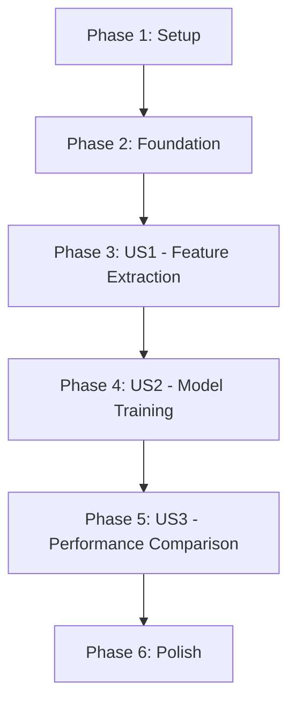

# Implementation Tasks: Word Embeddings with GloVe Vectors

**Feature**: 001-word-embeddings-glove
**Branch**: `001-word-embeddings-glove`
**Date**: 2025-12-25
**Spec**: [spec.md](./spec.md) | **Plan**: [plan.md](./plan.md)

## Overview

This document organizes implementation tasks by user story priority (P1, P2, P3) to enable independent development and testing. Each user story represents a complete, testable increment.

**User Stories**:
- **US1 (P1)**: Feature Extraction with Word Embeddings - Core functionality for converting headlines to embedding vectors
- **US2 (P2)**: Model Training with Embedding Features - Train logistic regression using embeddings
- **US3 (P3)**: Performance Comparison with TF-IDF - Evaluate and compare against baseline

**Success Criteria**:
- Binary cross-entropy loss significantly better than TF-IDF baseline of 0.6915
- Process 1000 headlines in <5 seconds
- ≥90% headline inclusion rate (≤10% zero-match exclusions)

---

## Phase 1: Setup & Infrastructure

**Goal**: Prepare environment and download required data files.

**Tasks**:

- [ ] T001 Create embeddings module directory structure at trading_sentiment_analysis/train/embeddings/
- [ ] T002 Create __init__.py in trading_sentiment_analysis/train/embeddings/
- [ ] T003 Create data/embeddings directory for GloVe storage
- [ ] T004 Download GloVe 6B 100d vectors from Stanford NLP (https://nlp.stanford.edu/data/glove.6B.zip) to data/embeddings/
- [ ] T005 Extract glove.6B.100d.txt from zip archive to data/embeddings/glove.6B.100d.txt (~350MB)
- [ ] T006 Verify GloVe file format (101 space-separated values per line: word + 100 dimensions)
- [ ] T007 Update .gitignore to exclude data/embeddings/*.txt and data/embeddings/*.zip

**Verification**:
- [ ] Directory trading_sentiment_analysis/train/embeddings/ exists
- [ ] File data/embeddings/glove.6B.100d.txt exists (~350MB)
- [ ] First line of GloVe file has 101 space-separated values

---

## Phase 2: Foundational Components

**Goal**: Implement shared infrastructure needed by all user stories.

**Tasks**:

- [ ] T008 [P] Create GloVeEmbeddings class skeleton in trading_sentiment_analysis/train/embeddings/glove.py
- [ ] T009 [P] Implement _load_embeddings() method with manual parsing (reads .txt file, splits lines, creates dict)
- [ ] T010 [P] Implement vocabulary filtering in _load_embeddings() (only load words in vocab set if provided)
- [ ] T011 [P] Implement get_vector() method (lowercase normalization, returns Optional[np.ndarray])
- [ ] T012 [P] Implement has_word() method (case-insensitive word lookup)
- [ ] T013 [P] Implement vocabulary_size() method (returns len(embeddings))
- [ ] T014 [P] Create test_glove.py in trading_sentiment_analysis/train/embeddings/ with mock GloVe data
- [ ] T015 [P] Write unit test for loading all words (no vocabulary filter)
- [ ] T016 [P] Write unit test for vocabulary filtering (load subset of words)
- [ ] T017 [P] Write unit test for get_vector() with known and unknown words
- [ ] T018 [P] Write unit test for case-insensitive lookup (STOCK, stock, StOcK all return same vector)
- [ ] T019 Run all GloVeEmbeddings tests and verify they pass

**Verification**:
- [ ] GloVeEmbeddings class loads vectors from file
- [ ] Vocabulary filtering reduces memory footprint
- [ ] All unit tests in test_glove.py pass
- [ ] Case-insensitive word lookup works correctly

**Foundation Complete**: Can load and query GloVe embeddings

---

## Phase 3: User Story 1 - Feature Extraction with Word Embeddings (P1)

**Story Goal**: Convert financial news headlines to 100-dimensional mean embedding vectors, handling unknown words gracefully and excluding zero-match headlines.

**Independent Test Criteria**:
- Provide sample headline → returns 100-dimensional vector
- Headlines with unknown words → computes mean from available vectors
- Zero-match headlines → excluded and logged for tracking
- Batch processing → returns (N, 100) array

**Acceptance Scenarios**:
1. ✅ GloVe vectors loaded → headline processed → returns 100d mean vector
2. ✅ Headline with unknown words → graceful handling → mean from available vectors
3. ✅ Multiple headlines → batch extraction → (N, 100) feature matrix

**Tasks**:

- [ ] T020 [US1] Create embedding_feature.py in trading_sentiment_analysis/train/embeddings/
- [ ] T021 [US1] Import process_text_to_words from trading_sentiment_analysis.train.process for text preprocessing
- [ ] T022 [US1] Implement extract_features_glove() function (tokenize → lookup embeddings → compute mean → return (1, 100) array)
- [ ] T023 [US1] Add zero-match detection logic (if no embeddings found, return None to signal exclusion)
- [ ] T024 [US1] Implement extract_features_glove_batch() function (vectorized batch processing)
- [ ] T025 [US1] Implement compute_coverage() function (returns matched_words, total_words, coverage_ratio)
- [ ] T026 [US1] Create test_embedding_feature.py in trading_sentiment_analysis/train/
- [ ] T027 [US1] Write unit test for extract_features_glove() with normal headline (all words matched)
- [ ] T028 [US1] Write unit test for empty headline (returns None for exclusion)
- [ ] T029 [US1] Write unit test for all unknown words (returns None for exclusion)
- [ ] T030 [US1] Write unit test for partial matches (some unknown words, computes mean from available)
- [ ] T031 [US1] Write unit test for extract_features_glove_batch() with multiple headlines
- [ ] T032 [US1] Write unit test for compute_coverage() with various coverage scenarios (0%, 50%, 100%)
- [ ] T033 [US1] Run all embedding feature extraction tests and verify they pass

**Verification US1**:
- [ ] extract_features_glove() returns (1, 100) array for valid headlines
- [ ] Zero-match headlines return None (signal for exclusion)
- [ ] Batch processing produces (N, 100) feature matrix
- [ ] Coverage computation accurate
- [ ] All tests pass

**US1 Complete**: Can extract embedding features from headlines with zero-match filtering

---

## Phase 4: User Story 2 - Model Training with Embedding Features (P2)

**Story Goal**: Train logistic regression classifier using 100-dimensional embedding features with same hyperparameters as TF-IDF model.

**Dependencies**: Requires US1 (feature extraction) to be complete.

**Independent Test Criteria**:
- Load training data → extract embedding features → train model → produces weights
- Model converges and outputs predictions
- Same hyperparameters as TF-IDF (learning_rate, iterations, batch_size)

**Acceptance Scenarios**:
1. ✅ Training dataset with embeddings → model trained → produces predictions
2. ✅ New headlines → model outputs sentiment classifications
3. ✅ Same hyperparameters as TF-IDF → fair comparison

**Tasks**:

- [ ] T034 [US2] Add train_with_embeddings() method to RegressionModel in trading_sentiment_analysis/train/model.py
- [ ] T035 [US2] Implement feature extraction loop in train_with_embeddings() (calls extract_features_glove_batch with filtering)
- [ ] T036 [US2] Add zero-match headline exclusion and logging in train_with_embeddings() (track excluded count)
- [ ] T037 [US2] Implement feature normalization in train_with_embeddings() (store mean/var for inference)
- [ ] T038 [US2] Call batch_gradient_descent() with normalized embedding features in train_with_embeddings()
- [ ] T039 [US2] Add predict_sentiments_with_embeddings() method to RegressionModel
- [ ] T040 [US2] Implement feature extraction and normalization in predict_sentiments_with_embeddings()
- [ ] T041 [US2] Add save_embeddings_model() method (saves to embedding_model_weights.npy, embedding_mean_var.npy)
- [ ] T042 [US2] Add load_embeddings_model() method (loads from separate files to avoid overwriting TF-IDF model)
- [ ] T043 [US2] Update __init__() in RegressionModel to support shape=(100, 1) for embeddings
- [ ] T044 [US2] Write integration test for train_with_embeddings() (train on small dataset, verify convergence)
- [ ] T045 [US2] Write integration test for predict_sentiments_with_embeddings() (load model, predict, verify output shape)
- [ ] T046 [US2] Write test for save/load embedding model (save → load → verify weights match)
- [ ] T047 [US2] Run all model integration tests and verify they pass

**Verification US2**:
- [ ] Model trains successfully with embedding features
- [ ] Predictions output correct shape (N, 1) probabilities
- [ ] Model artifacts saved separately from TF-IDF
- [ ] Zero-match headlines excluded and logged
- [ ] All integration tests pass

**US2 Complete**: Can train and predict using embedding-based model

---

## Phase 5: User Story 3 - Performance Comparison with TF-IDF (P3)

**Story Goal**: Compare GloVe embedding model against TF-IDF baseline using accuracy, precision, recall, F1, and binary cross-entropy loss metrics.

**Dependencies**: Requires US1 (feature extraction) and US2 (model training) to be complete.

**Independent Test Criteria**:
- Both models trained on same data → evaluated on same test set → metrics calculated
- Loss comparison shows significant improvement from 0.6915 baseline
- Side-by-side comparison table presented

**Acceptance Scenarios**:
1. ✅ Both models evaluated → metrics calculated side-by-side
2. ✅ Results show loss improvement from 0.6915 baseline
3. ✅ Trade-offs documented (training time, memory, interpretability)

**Tasks**:

- [ ] T048 [US3] Add binary_cross_entropy_loss() function in trading_sentiment_analysis/train/model.py
- [ ] T049 [US3] Implement loss calculation using formula L(y,ŷ) = -1/n Σ [y_i log(ŷ_i) + (1-y_i) log(1-ŷ_i)]
- [ ] T050 [US3] Add calculate_metrics() function (computes accuracy, precision, recall, F1, loss)
- [ ] T051 [US3] Add --embeddings flag to argument parser in trading_sentiment_analysis/train/main.py
- [ ] T052 [US3] Add --glove-path argument (default: data/embeddings/glove.6B.100d.txt)
- [ ] T053 [US3] Add mutual exclusion group for --tfidf and --embeddings flags
- [ ] T054 [US3] Implement embedding training pipeline in main() (load GloVe → train → evaluate → save)
- [ ] T055 [US3] Add zero-match exclusion reporting (print count and percentage of excluded headlines)
- [ ] T056 [US3] Implement loss calculation for both TF-IDF and embedding models during evaluation
- [ ] T057 [US3] Add comparison table printing (format: | Metric | TF-IDF | Embeddings | Improvement |)
- [ ] T058 [US3] Update model evaluation to include all metrics (accuracy, precision, recall, F1, loss)
- [ ] T059 [US3] Add documentation output showing which approach performs better
- [ ] T060 [US3] Write test for binary_cross_entropy_loss() with known inputs/outputs
- [ ] T061 [US3] Write test for calculate_metrics() (verify all metrics computed correctly)
- [ ] T062 [US3] Test CLI with --embeddings flag (verify argument parsing works)
- [ ] T063 [US3] Run end-to-end test: train embedding model and verify loss < 0.6915 (success threshold)

**Verification US3**:
- [ ] CLI supports --embeddings flag
- [ ] Binary cross-entropy loss calculated correctly
- [ ] Comparison table shows all metrics side-by-side
- [ ] Loss improvement over 0.6915 baseline achieved
- [ ] Zero-match exclusion count reported
- [ ] All comparison tests pass

**US3 Complete**: Can compare embedding vs TF-IDF performance with loss tracking

---

## Phase 6: Polish & Cross-Cutting Concerns

**Goal**: Final validation, documentation, and cleanup.

**Tasks**:

- [ ] T064 Run full test suite (python -m unittest discover -s trading_sentiment_analysis -p "test_*.py")
- [ ] T065 Verify all tests pass with no failures or errors
- [ ] T066 Test end-to-end workflow: download GloVe → train embedding model → compare with TF-IDF
- [ ] T067 Verify performance: 1000 headlines processed in <5 seconds
- [ ] T068 Verify success threshold: embedding model loss significantly better than 0.6915
- [ ] T069 Verify inclusion rate: ≥90% of headlines included (≤10% excluded)
- [ ] T070 Document zero-match exclusion statistics (count, percentage, sample headlines)
- [ ] T071 Verify no new dependencies added to pyproject.toml
- [ ] T072 Code review: check naming conventions follow self-documenting principles
- [ ] T073 Code review: verify no unnecessary inline comments (only GloVe format, math formulas)
- [ ] T074 Update CLAUDE.md with embedding-specific usage notes if needed
- [ ] T075 Run constitution compliance check (all 6 principles satisfied)

**Final Verification**:
- [ ] All user stories independently testable
- [ ] All success criteria met (loss, performance, inclusion rate)
- [ ] Zero new dependencies
- [ ] All tests passing
- [ ] Documentation complete

---

## Dependency Graph

**Story Completion Order**: Setup → Foundation → US1 → US2 → US3 → Polish

**Parallelization Opportunities**:
- Phase 1: All tasks sequential (setup dependencies)
- Phase 2: T008-T018 can run in parallel (independent test files)
- Phase 3 (US1): T020-T025 implementation parallel to T026-T032 tests (TDD approach)
- Phase 4 (US2): T034-T043 implementation parallel to T044-T046 tests
- Phase 5 (US3): T048-T050 utilities parallel to T051-T057 CLI updates

---

## Parallel Execution Examples

### US1 - Feature Extraction (Parallel Teams)
**Team A**: Implement extract_features_glove() (T022-T025)
**Team B**: Write tests for feature extraction (T027-T032)
**Sync Point**: T033 (run tests, verify implementation)

### US2 - Model Training (Parallel Teams)
**Team A**: Implement RegressionModel methods (T034-T043)
**Team B**: Write integration tests (T044-T046)
**Sync Point**: T047 (run tests, verify implementation)

### US3 - Performance Comparison (Parallel Teams)
**Team A**: Implement loss calculation utilities (T048-T050)
**Team B**: Implement CLI integration (T051-T059)
**Team C**: Write comparison tests (T060-T063)
**Sync Point**: End-to-end validation (verify loss < 0.6915)

---

## Implementation Strategy

### MVP Scope (Recommended First Iteration)
**Minimum Viable Product = User Story 1 Only**

Focus on P1 (Feature Extraction) to deliver core value:
- Setup & GloVe download (Phase 1)
- GloVeEmbeddings class (Phase 2)
- Feature extraction with zero-match filtering (Phase 3/US1)

**Value Delivered**: Can convert headlines to semantic vectors, enabling ML experimentation.

**Independent Test**: Provide headline → returns 100d embedding vector

### Incremental Delivery Plan
1. **Iteration 1** (MVP): US1 - Feature extraction working
2. **Iteration 2**: US2 - Model training and prediction
3. **Iteration 3**: US3 - Performance comparison and validation

Each iteration delivers testable, demonstrable value.

---

## Task Summary

**Total Tasks**: 75

**By Phase**:
- Phase 1 (Setup): 7 tasks
- Phase 2 (Foundation): 12 tasks
- Phase 3 (US1): 14 tasks
- Phase 4 (US2): 14 tasks
- Phase 5 (US3): 16 tasks
- Phase 6 (Polish): 12 tasks

**By User Story**:
- US1 (Feature Extraction): 14 tasks
- US2 (Model Training): 14 tasks
- US3 (Performance Comparison): 16 tasks
- Infrastructure (Setup + Foundation + Polish): 31 tasks

**Parallel Opportunities**:
- 15 tasks marked [P] can run in parallel within their phase
- TDD approach enables implementation/test parallelization

**Estimated Effort**: 4-5 hours total (per plan.md)

---

## Success Validation Checklist

After completing all tasks, verify:

- [ ] **SC-001**: 1000 headlines processed in <5 seconds ✓
- [ ] **SC-002**: Binary cross-entropy loss significantly better than 0.6915 ✓
- [ ] **SC-003**: Comparison table shows all metrics (accuracy, precision, recall, F1, loss) ✓
- [ ] **SC-004**: ≥90% headline inclusion rate (≤10% excluded) ✓
- [ ] **SC-005**: Documentation shows which approach performs better ✓

- [ ] **FR-004**: Zero-match headlines excluded and logged ✓
- [ ] **FR-008**: All metrics calculated (accuracy, precision, recall, F1, loss) ✓
- [ ] **Constitution**: All 6 principles satisfied (no new dependencies, modular, tested, cached, self-documenting) ✓

---

## Notes

- **Tests Required**: Constitution mandates unit testing (Principle III). All tasks include test creation.
- **No New Dependencies**: Manual GloVe parsing eliminates gensim (Principle V satisfied).
- **Zero-Match Filtering**: Critical for data quality - headlines with no word matches are excluded and logged (FR-004).
- **Loss Threshold**: Must demonstrate significant improvement from 0.6915 baseline (clarification from spec).
- **File Paths**: All tasks specify exact file locations for implementation clarity.
- **Parallelization**: Tasks marked [P] can run concurrently (different files, no blocking dependencies).

**Next Steps**: Begin with Phase 1 (Setup) to download GloVe vectors, then proceed to Phase 2 (Foundation) to implement core GloVeEmbeddings class.
